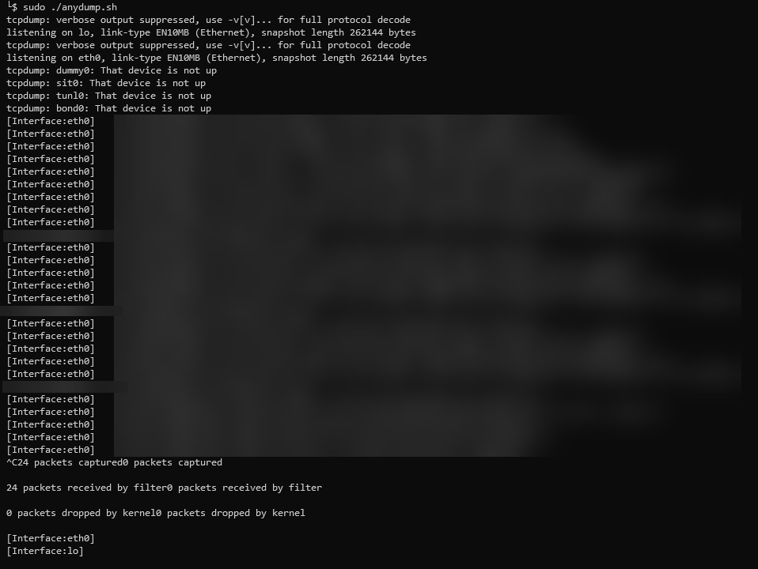

# AnyDump
---
## Description
Script used to run tcpdump on all interfaces and detail the interface the traffic is coming from. Handy when working with containers. 

#### Recognition
I did not write the initial script but have modified the work of Sebastian Haas (https://sebastianhaas.de/anydump-release/) (I could'nt find his github).